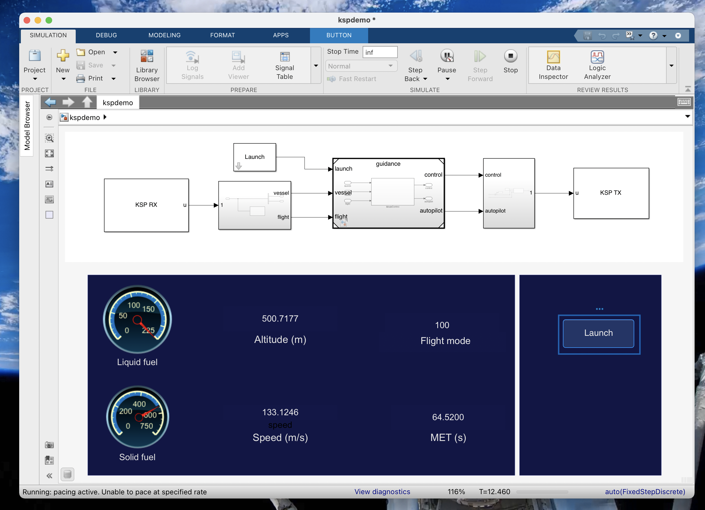
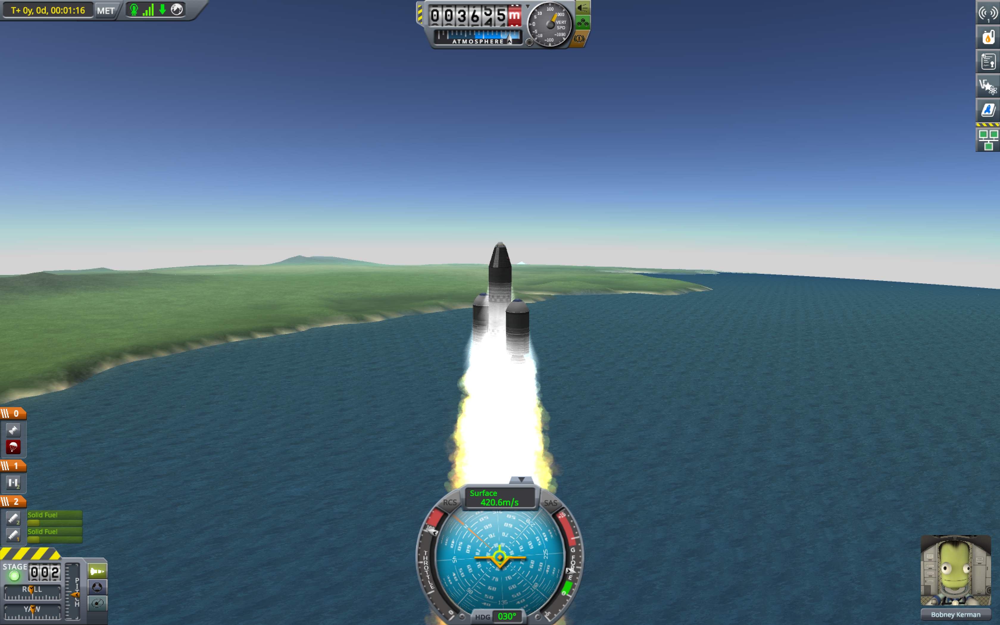

# sl-ksp
Control a rocket in Kerbal Space Program from Simulink.

The ksplib block library provides Simulink blocks that use the kRPC Python API to communicate with KSP.

## Dependencies
Kerbal Space Program 1.5.1  
[krpc 0.4.8](https://krpc.github.io/krpc)  
MATLAB R2020b  
Simulink  
Stateflow  
Python 2.7


## Setup
See [this video](https://www.youtube.com/watch?v=RQzWri_K_UY) for kRPC setup instructions.  
Before first simulation, open MATLAB, open the .prj, and enter the command  
```
ksp.addSrcToPythonPath  
```
to add the module slksp.py to the Python path.

## Examples, cool pictures, etc.

Open Slksp.prj.  
Open kspdemo.slx.    
Open KSP and put a rocket on the launch pad.  
Simulate the model.  

<p float = "left">
    
    
</p>

## To do
- [ ] Refactor TX, RX blocks so that they share one krpc object.
- [ ] Improve mission planning UI.
