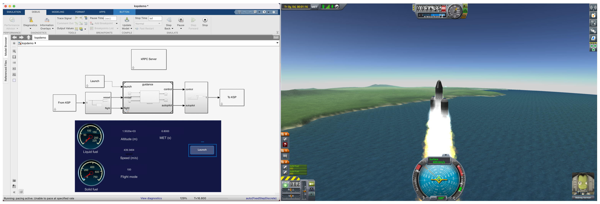

# sl-ksp
Control a rocket in Kerbal Space Program from Simulink.

This block library provides Simulink blocks that use kRPC to communicate with KSP.

<p float = "left">
    
</p>

The goal of this project is to allow for controls and optical navigation
algorithms (which may be written in MATLAB, Python, C, C++, or Simulink)
to be tested in Kerbal Space Program, which provides the physics-based
simulation and generates images.

## Dependencies
Kerbal Space Program 1.5.1 (see kRPC setup video linked below)  
[krpc 0.4.8](https://krpc.github.io/krpc)  
MATLAB R2020b  
Simulink  
Stateflow  
Python 3.x


## Setup

### kRPC setup
Follow the kRPC setup instructions given in this video:
[OS X](https://www.youtube.com/watch?v=x6wdnge-hZU&t=0s),
[PC](https://www.youtube.com/watch?v=RQzWri_K_UY).  

Basically, the steps in the video above are (assuming you already have
Python 3 up and running):  
- Install KSP v1.5.1 using steam (right-click Kerbal Space Program, go to
Properties -> Betas).  
- Download the KSP [kRPC mod](https://spacedock.info/mod/69/kRPC).  
- Copy the kRPC folder from this download to the KSP GameData folder (find
it by right-clicking Kerbal Space Program in Steam and go to Manage ->
Browse local files).  

### MATLAB Python path
Make sure that MATLAB is using the right Python path. Open MATLAB and
enter the command  
```
pyenv
```
This will tell you which Python version you're using.
I needed to tell MATLAB to use Python 3.8 by doing the following.  
Open a terminal and identify the path to my python3:
```
python3
import sys
sys.executable
```
Copy the path that is printed (for example, mine looks something like
'<...>/usr/bin/python3').  
Go back to MATLAB and enter the command  
```
pyversion('<...>/user/bin/python3')  
```
where the pyversion() input argument is the `sys.executable` output.

### Project setup
Open MATLAB, double-click on Slksp.prj in the Current Folder window, and
enter the command  
```
ksp.addSrcToPythonPath  
```
to add the module at /src/slksp.py to sys.path.

## How to run the example model

- Open Slksp.prj.  
- Open KSP and put a rocket on the launch pad.
- If the kRPC server window does not appear in the KSP window, select the
icon marked in the image below.
- Press the Start server button.  

<p float = "left">
    
</p>

- Simulate the model.
- Check the KSP window. Accept the kRPC connection request if a kRPC prompt
appears.  
- Press the Launch button in the Simulink model.

## To do
- [x] Refactor TX, RX blocks so that they share one kRPC object.
- [ ] Retrieve images from KSP to use for navigation.
- [ ] Improve mission planning UI.
- [ ] Reset fuel query at stage separation.
- [ ] Package as toolbox.
