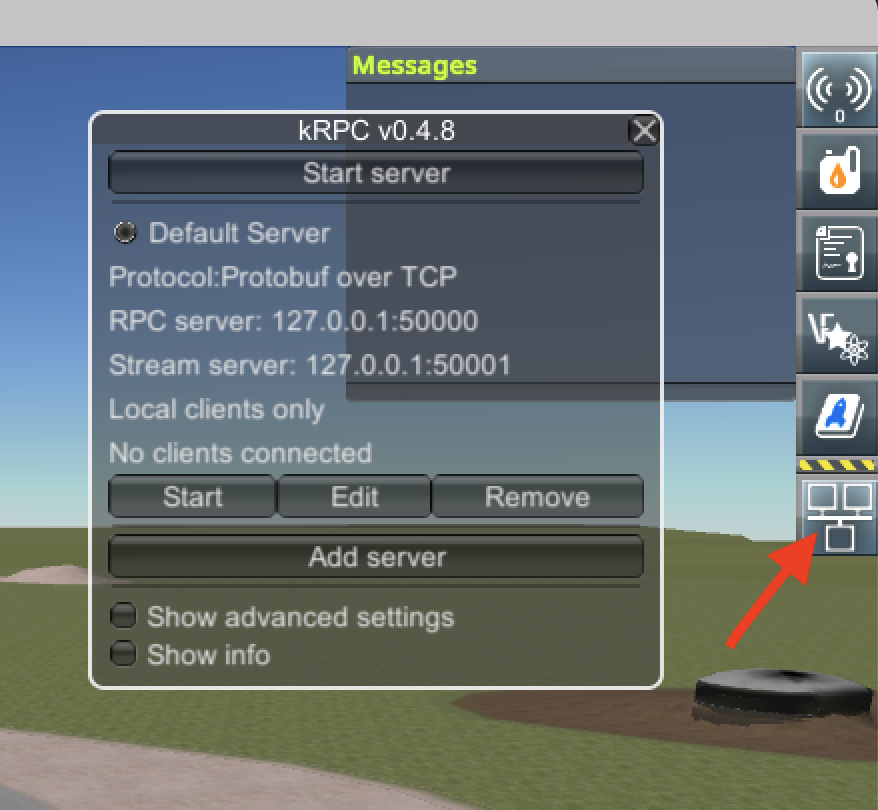

# KSP Toolbox

KSP Toolbox provides Simulink blocks and MATLAB functions that can be used to
control a rocket in 
[Kerbal Space Program](https://en.wikipedia.org/wiki/Kerbal_Space_Program) 
(KSP) from Simulink. 


## Highlights

KSP Toolbox enables cosimulation with Simulink and Kerbal Space Program. 
It provides a Simulink block library that allows any Simulink model to 
communicate with KSP in real time.

This enables 
- multidomain simulation capabilities (controls, vision, comms, ...),  
- the coolest flight simulation visualization capabilities, period,
- and turbocharged engineering analysis capabilities for KSP missions.

KSP Toolbox leverages Kerbal Space Program's physics engine, allowing you 
to create GN&C algorithms in Simulink and then immediately run flight 
simulations with KSP. 


## Dependencies

Kerbal Space Program 1.5.1  
[kRPC 0.4.8](https://krpc.github.io/krpc)  
MATLAB R2020b  
Simulink    
Python 3.x  
Stateflow (required to simulate example models)


## Setup

### Install KSP Toolbox
- Download the toolbox installer at
[/release/KSPToolbox.mltbx](https://github.com/brhannan/sl-ksp/tree/main/release).
You can download this file to any location on your machine. This is the 
only file that is needed. You do not need to download the entire GitHub 
repository to install the toolbox.  
- Open MATLAB and navigate to the folder that contains KSPToolbox.mltbx.  
- Double-click KSPToolbox.mltbx in the MATLAB Current Folder window to
install KSP Toolbox.  

### Get the kprc Python module

KSP Toolbox blocks use the krpc Python module to communicate with 
Kerbal Space Program.  
**If you already have Python and pip installed**, open a terminal and use the 
command 
```pip install krpc``` to install krpc.  
**If you do not currently have Python and/or pip installed**, follow all 
setup instructions listed 
[here](https://krpc.github.io/krpc/getting-started.html).

### Get Kerbal Space Program

Get 
[Kerbal Space Program from Steam](https://store.steampowered.com/app/220200/Kerbal_Space_Program/).  
You need to install KSP from this source. Steam is required for the steps below.  

### Get the kRPC mod

Follow the kRPC setup instructions given in this video:
[OS X](https://www.youtube.com/watch?v=x6wdnge-hZU&t=0s),
[PC](https://www.youtube.com/watch?v=RQzWri_K_UY).  

The TLDR for the video above is:  
- Install KSP v1.5.1 using Steam. Open Steam, right-click Kerbal Space Program,
go to Properties -> Betas and select v1.5.1.  
- Download the KSP [kRPC mod](https://spacedock.info/mod/69/kRPC).  
- Copy the kRPC folder downloaded in the step above to the KSP GameData folder
(find it by right-clicking Kerbal Space Program in Steam and go to Manage ->
Browse local files).  

### Call Python from MATLAB

See
[this doc page](https://www.mathworks.com/help/matlab/call-python-libraries.html)
for instructions that will allow you to execute Python commands from MATLAB.

Open MATLAB and enter the command
```py.print("hello world")``` in the Command Window to confirm that the
setup was successful. The KSP Toolbox Simulink blocks use the Python kRPC
API, so make sure that MATLAB and Python are on speaking terms before
proceeding. If this command produces an error, see the **Troubleshooting** 
section below.  


## Run the example model

KSP Toolbox contains a simple example model. Run it using the steps below. 
- Open an example project using the MATLAB command 
```ksp.openSuborbitalFlightExample```  
- Open KSP and put any rocket on the pad.  
- If the kRPC server window doesn't automatically appear in the KSP window,
select the button shown by the red arrow in the image below. Press the
Start server button.  

<p float = "left">
    
</p>

- Simulate the model.
- Check the KSP window. Accept the kRPC connection request if a kRPC prompt
appears.  
- Go back to the Simulink window and press the Launch button.  
- Watch the altimeter climb. Landing is left as an exercise for the reader.  


## Creating custom models with KSP Toolbox

Use the command ```ksp.createNewModel``` to open a template KSP Toolbox 
model. Add arbitrary components, connect them to the FromKSP and ToKSP 
blocks in this model, and you're ready to go.    

Alternatively, follow the steps below to manually create a new model using
KSP Toolbox blocks.
- Create a new Simulink model.
- Open the Configuration Parameters and select a fixed-step solver.
- Choose a step size. The example model uses a solver step size of 0.1.
- Enter the MATLAB command ```ksplib``` to open the KSP Toolbox library.
- Copy a KSPServer block, a ToKSP block, and a FromKSP block to the model.
- The ToKSP and FromKSP blocks require specific bus objects. Create these
bus objects using the MATLAB command ```ksp.bus.getAll```. See this 
function's  command-line help for more info (enter the  command 
```help ksp.bus.getAll```).  


## Troubleshooting

If you see an "Unable to resolve the name py.slksp.SLKSPMessenger" error,
try the following.
- Enter the command ```ksp.addSrcToPythonPath``` and simulate again.
- Enter the command ```matlab.addons.installedAddons``` and ensure that 
KSP Toolbox is on the list of installed products. If it isn't, see the 
install steps above.
- See [this doc page](https://www.mathworks.com/help/matlab/matlab_external/undefined-variable-py-or-function-py-command.html)
for debugging steps.
- Check that you are able to import krpc in a Python prompt (not MATLAB).
If this doesn't work, see the kRPC installation link above.


## To do
- [x] Refactor TX, RX blocks so that they share one kRPC object.
- [x] Package as toolbox.
- [x] Add orbit apoapsis/periapsis to parameters received from KSP.
- [x] Add SAS commands (prograde, retrograde, etc.).
- [x] Get [orbit params](https://krpc.github.io/krpc/python/api/space-center/orbit.html) from KSP: radius, eccentricity.
- [ ] Complete orbital flight example.
- [ ] Add test suite.
- [ ] Add HTML block documentation.
- [ ] Add image capture tools for optical nav simulation.


## License

Copyright 2020, Brian Hannan. Released under the
[MIT License](https://github.com/brhannan/sl-ksp/blob/main/LICENSE).
