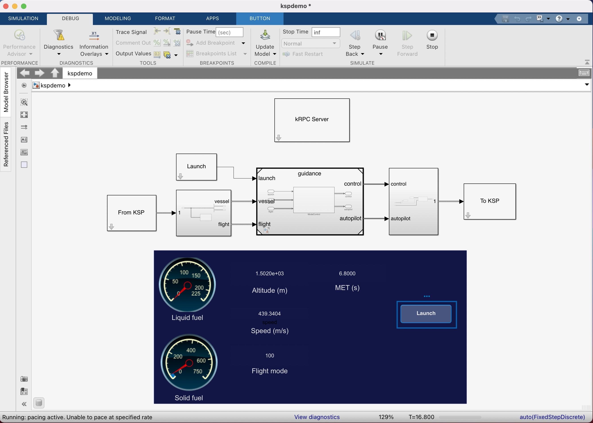

# sl-ksp
Control a rocket in Kerbal Space Program from Simulink.

## Dependencies
Kerbal Space Program 1.5.1  
[krpc 0.4.8](https://krpc.github.io/krpc)  
MATLAB R2020b  
Simulink  
Stateflow  
Python 3.x

## Setup
See [this page](erikreinersten.com/python-3-in-matlab) to get MATLAB to understand "python3".  
See [this video](https://www.youtube.com/watch?v=RQzWri_K_UY) for kRPC setup instructions.

## Examples, cool pictures, etc.

    
    

